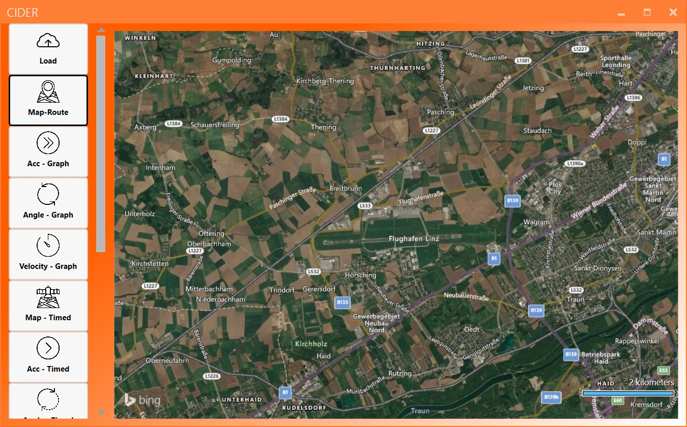
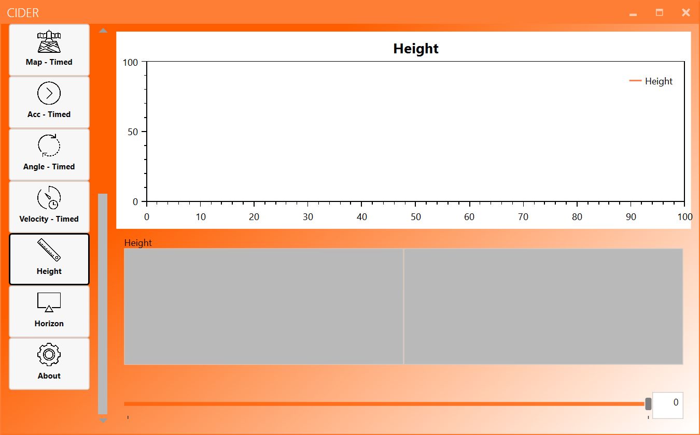
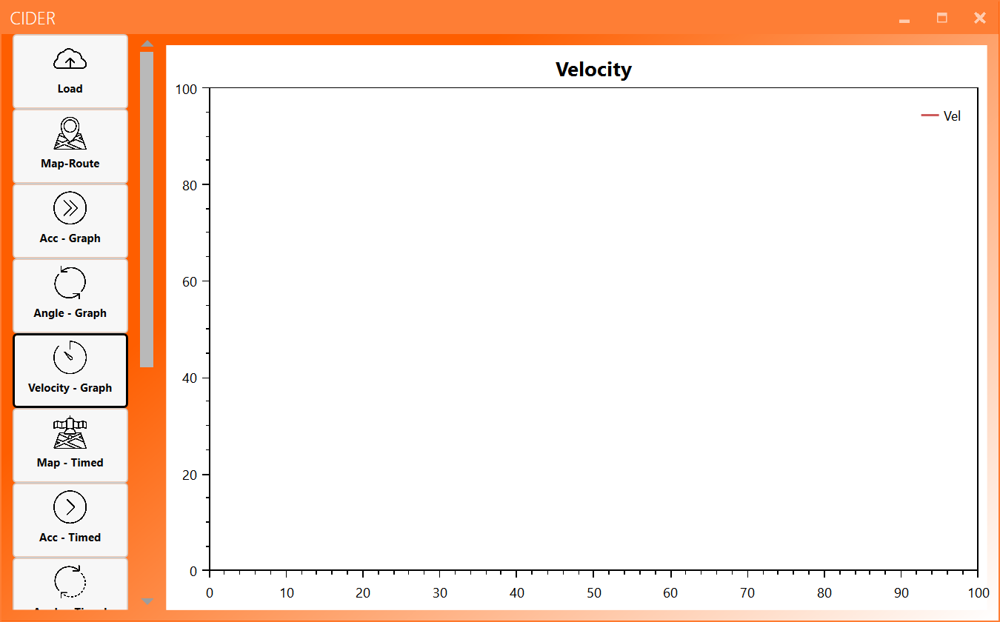

#The Views
The following article is going to explain the different views available in the application and what their use is.

##About View

The "about" view is the standard (startup) view of the application. The "about" view contains multiple features:

1. SET API KEY - press this button to set the reference to an API key (.key) file
2. CHANGE THEME - press this button to open the theme manager
3. E-MAIL US! - press this button to open your e-mail program and send an e-mail to us
4. VIEW LICENSES - press this button to open the license manager

##Theme Manager

The theme manager allows you to change the look and feel of the application. You can select a light and a dark theme as well as different accent colours. The settings will be remembered for the next startups.

1. Select the Theme - Dark or Light
2. Select the Accent colour - see the table below

<table class="tg" style="undefined;table-layout: fixed; width: 327px">
<colgroup>
<col style="width: 105px">
<col style="width: 222px">
</colgroup>
  <tr>
    <th class="tg-0pky">Amber</th>
    <th class="tg-hwtc"></th>
  </tr>
  <tr>
    <td class="tg-0pky">Blue</td>
    <td class="tg-gq7d"></td>
  </tr>
  <tr>
    <td class="tg-0pky">Brown</td>
    <td class="tg-pvdm"></td>
  </tr>
  <tr>
    <td class="tg-0pky">Cider Standard</td>
    <td class="tg-ihgh"></td>
  </tr>
  <tr>
    <td class="tg-0pky">Cobalt</td>
    <td class="tg-1l53"></td>
  </tr>
  <tr>
    <td class="tg-0pky">Crimson</td>
    <td class="tg-wfuo"></td>
  </tr>
  <tr>
    <td class="tg-0pky">Cyan</td>
    <td class="tg-rxq3"></td>
  </tr>
  <tr>
    <td class="tg-0pky">Emerald</td>
    <td class="tg-6t9d"></td>
  </tr>
  <tr>
    <td class="tg-0pky">Green</td>
    <td class="tg-vp5j"></td>
  </tr>
  <tr>
    <td class="tg-0pky">Indigo</td>
    <td class="tg-h52n"></td>
  </tr>
  <tr>
    <td class="tg-0pky">Lime</td>
    <td class="tg-yzin"></td>
  </tr>
  <tr>
    <td class="tg-0pky">Magenta</td>
    <td class="tg-w6ui"></td>
  </tr>
  <tr>
    <td class="tg-0pky">Mauve</td>
    <td class="tg-3rap"></td>
  </tr>
  <tr>
    <td class="tg-0pky">Olive</td>
    <td class="tg-axb2"></td>
  </tr>
  <tr>
    <td class="tg-0pky">Orange</td>
    <td class="tg-hjat"></td>
  </tr>
  <tr>
    <td class="tg-0pky">Pink</td>
    <td class="tg-j3ct"></td>
  </tr>
  <tr>
    <td class="tg-0pky">Purple</td>
    <td class="tg-j8ey"></td>
  </tr>
  <tr>
    <td class="tg-0pky">Red</td>
    <td class="tg-nclw"></td>
  </tr>
  <tr>
    <td class="tg-0pky">Sienna</td>
    <td class="tg-k666"></td>
  </tr>
  <tr>
    <td class="tg-0pky">Steel</td>
    <td class="tg-pdtb"></td>
  </tr>
  <tr>
    <td class="tg-0pky">Taupe</td>
    <td class="tg-mdmw"></td>
  </tr>
  <tr>
    <td class="tg-0pky">Teal</td>
    <td class="tg-c5n5"></td>
  </tr>
  <tr>
    <td class="tg-0pky">Violet</td>
    <td class="tg-d1zl"></td>
  </tr>
  <tr>
    <td class="tg-0pky">Yellow</td>
    <td class="tg-63uj"></td>
  </tr>
</table>

##Map Views

The map views are only available if a valid key was added to the application. If you have not done this already, head to [__this tutorial__](how_to.html#setup) on how to do that.

###Map - Route
The map-route view allows seeing the recorded route on bing maps. The view will automatically focus on the route. The start direction is marked by a bright blue arrow, following the direction of the arrow follows the recorded data. If no route is loaded, the map will be focused on Linz-Hörsching airport.

###Map - Timed
The map-timed view shows the recorded route and a slider. Adjusting the slider gradually increases the shown part of the route. The shown part is increased on a per-data-point basis so you can slowly show the flown route.

##Load View
The load view is used to select a valid dataset. Pressing the "..."-button opens a menu where a folder can be selected. After accepting the selected folder by pressing "Ok", the application checks the validity and data integrity of the selected folder. If the check fails, a cross is displayed. If the check passes, a tick is displayed. If the tick is displayed, the "Load"-button is set to be available. Pressing the "Load"-button loads the selected data. During the loading procedure, the navigation bar to the side of the application turns grey. When the loading process is finished, the buttons are made available again.

The load view:

The view with a valid dataset:

The view with an invalid dataset:

##The Height View
The height view shows the height of the plane. There are two parts: The first part shows a graph of the flight height throughout the flight. The second part shows the current height, adjustable by a slider found at the bottom of the view. You can also enter a specific value (only numbers without comma!) in the box found to the right of the slider - this will set the value of the slider to the entered value.

The height view:

##The Angle Views
###Angle Timed
Using the angle-timed view you can watch the roll, pitch, and yaw angles of the plane at every point. The data point shown can be selected using the slider at the bottom of the page. Alternatively, you could also enter a value in the text field next to the slider.

The angle-timed view:

###Angle Graph
The angle-graph view shows the roll, pitch, and yaw angles over the whole duration of the recording.

The angle-graph view:

##The Acceleration Views
###Acceleration Timed
The acceleration-timed view can be used to access the recorded acceleration data in all 3 directions. The data point shown can be selected using the slider at the bottom of the page. Alternatively, you could also enter a value in the text field next to the slider.

The acceleration-timed view:

###Acceleration Graph
The acceleration-graph view shows the accelerations in the three directions as a graph. The whole duration of the flight is printed to the graph.

The acceleration-graph view:

##The Velocity Views
###Velocity Timed
The velocity-timed view shows the velocity of the airplane at the currently selected time. The data can be selected using the slider or by manually entering a number in the box to the left of the slider.

The velocity-timed view:

###Velocity Graph
The velocity-graph view can be used to display the velocity of the airplane throughout the flight.

The velocity-graph view:

##The Artificial Horizon
The artificial horizon is a view that unites almost all of the recorded values in one place. Just like in a real airplane, you can see the climb rate, the heading, the velocity, and the roll and pitch angles.

The artificial horizon looks like this:

##The license manager
The license manager is the first window shown when you start the application for the first time. It contains all the necessary licenses and agreements. To be able to use the software as intended you need to accept the licenses and press the green button in the bottom left corner of the view.

