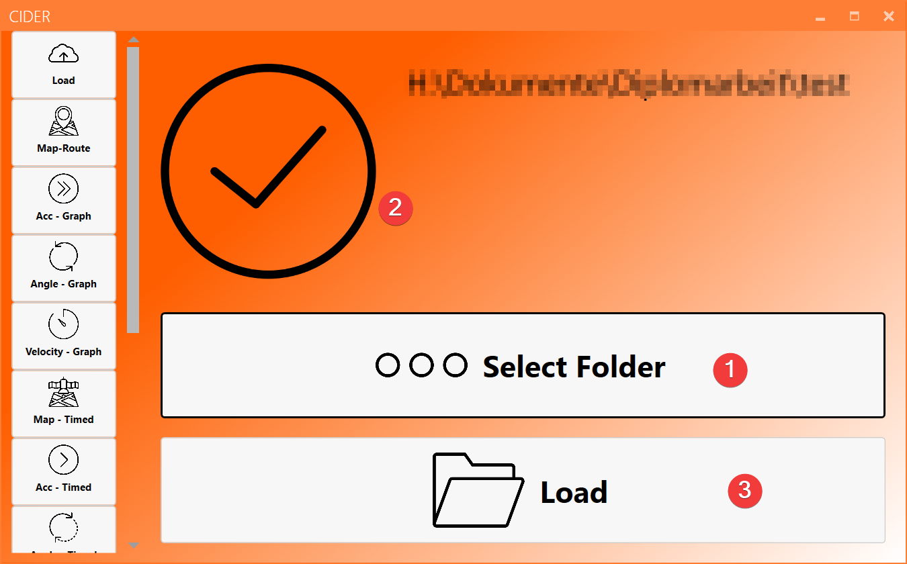
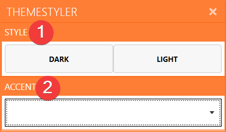
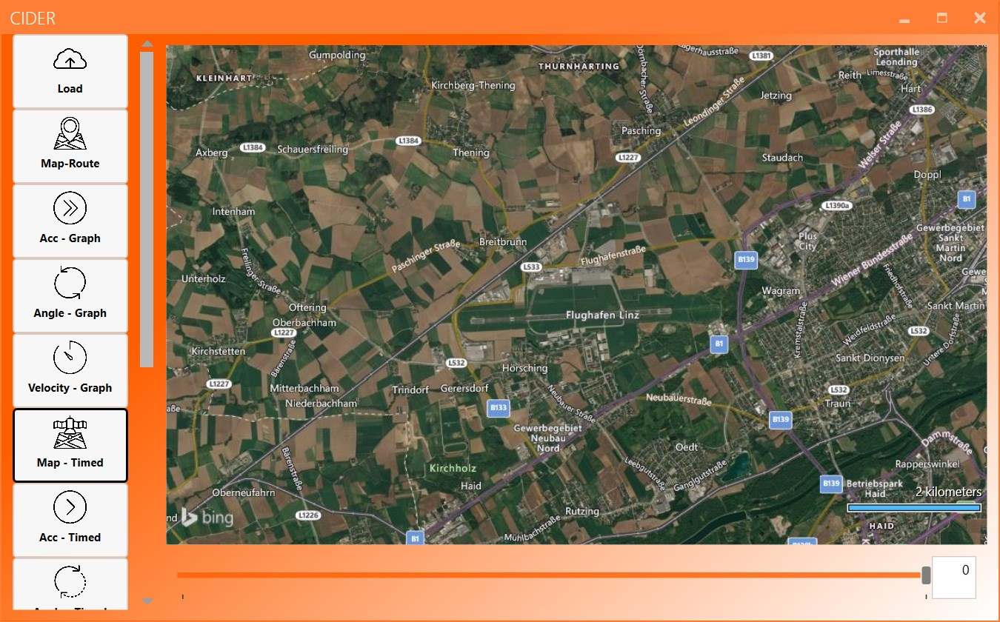
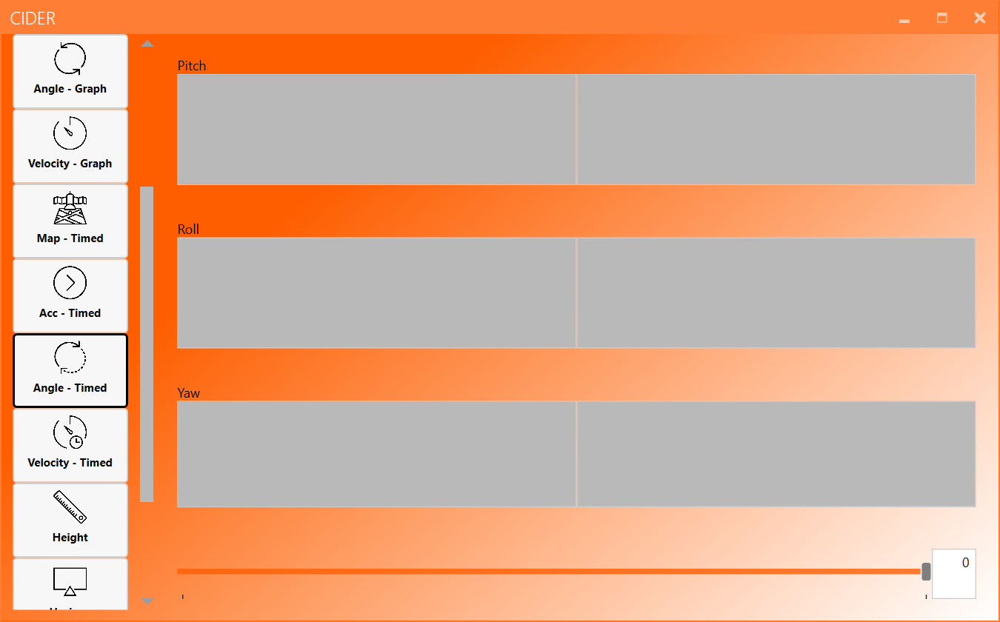
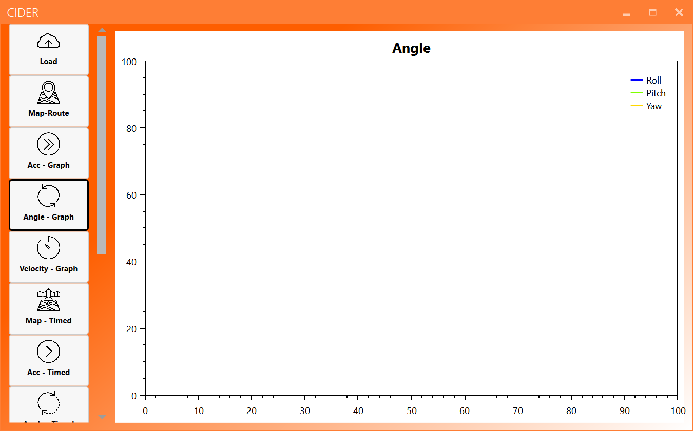
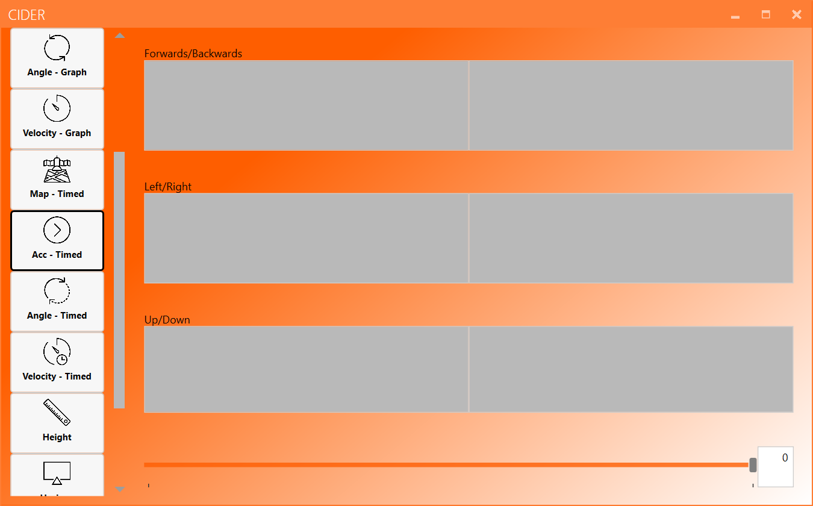
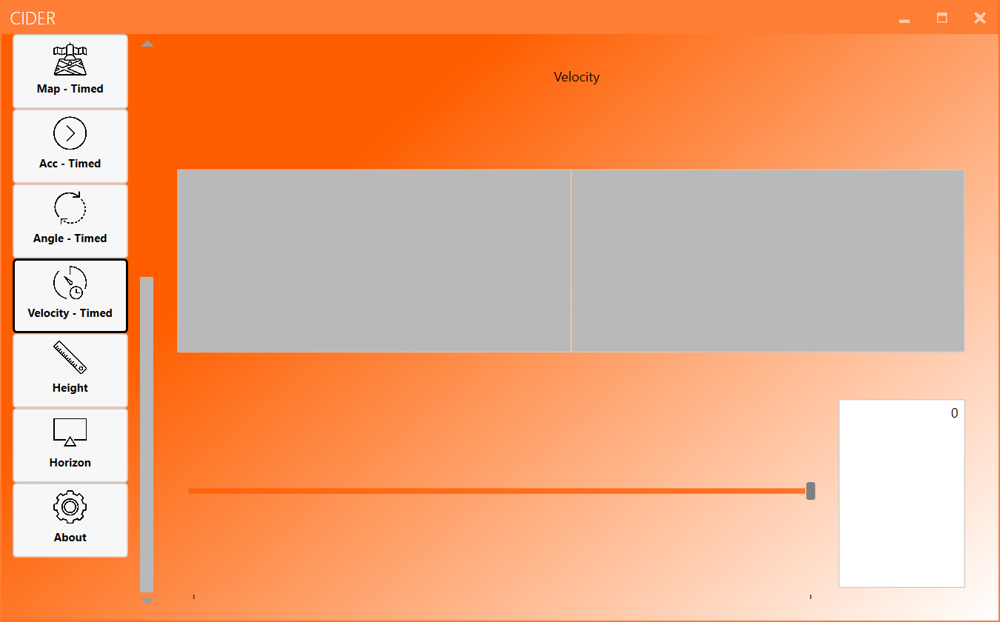

#Die Anzeigen
Der folgende Artikel wird die verschiedenen in der Anwendung verfügbaren Ansichten und deren Verwendung erläutern.

##About-Ansicht

Die "about"-Ansicht ist die Standardansicht (Startup) der Anwendung. Die Ansicht "about" enthält mehrere Funktionen:

1. API-Schlüssel festlegen - drücken Sie diese Taste, um den Verweis auf eine API-Schlüsseldatei (.key) zu setzen.
2. CHANGE THEME - drücken Sie diese Taste, um den Designmanager zu öffnen.
3. E-MAIL US! - Drücken Sie diese Taste, um Ihr E-Mail-Programm zu öffnen und eine E-Mail an uns zu senden.
4. VIEW LICENSES - drücken Sie diese Taste, um den Lizenzmanager zu öffnen.

##Designmanager

Der Design-Manager ermöglicht es Ihnen, das Aussehen der Anwendung zu ändern. Sie können zwischen einem hellen und einem dunklen Thema sowie verschiedenen Akzentfarben wählen. Die Einstellungen werden für die nächsten Starts gespeichert.

1. Wählen Sie das Thema - Dunkel oder Hell - aus.
2. Wählen Sie die Akzentfarbe - siehe Tabelle unten.

<table class="tg" style="undefined;table-layout: fixed; width: 327px">
<colgroup>
<col style="width: 105px">
<col style="width: 222px">
</colgroup>
  <tr>
    <th class="tg-0pky">Amber</th>
    <th class="tg-hwtc"></th>
  </tr>
  <tr>
    <td class="tg-0pky">Blue</td>
    <td class="tg-gq7d"></td>
  </tr>
  <tr>
    <td class="tg-0pky">Brown</td>
    <td class="tg-pvdm"></td>
  </tr>
  <tr>
    <td class="tg-0pky">Cider Standard</td>
    <td class="tg-ihgh"></td>
  </tr>
  <tr>
    <td class="tg-0pky">Cobalt</td>
    <td class="tg-1l53"></td>
  </tr>
  <tr>
    <td class="tg-0pky">Crimson</td>
    <td class="tg-wfuo"></td>
  </tr>
  <tr>
    <td class="tg-0pky">Cyan</td>
    <td class="tg-rxq3"></td>
  </tr>
  <tr>
    <td class="tg-0pky">Emerald</td>
    <td class="tg-6t9d"></td>
  </tr>
  <tr>
    <td class="tg-0pky">Green</td>
    <td class="tg-vp5j"></td>
  </tr>
  <tr>
    <td class="tg-0pky">Indigo</td>
    <td class="tg-h52n"></td>
  </tr>
  <tr>
    <td class="tg-0pky">Lime</td>
    <td class="tg-yzin"></td>
  </tr>
  <tr>
    <td class="tg-0pky">Magenta</td>
    <td class="tg-w6ui"></td>
  </tr>
  <tr>
    <td class="tg-0pky">Mauve</td>
    <td class="tg-3rap"></td>
  </tr>
  <tr>
    <td class="tg-0pky">Olive</td>
    <td class="tg-axb2"></td>
  </tr>
  <tr>
    <td class="tg-0pky">Orange</td>
    <td class="tg-hjat"></td>
  </tr>
  <tr>
    <td class="tg-0pky">Pink</td>
    <td class="tg-j3ct"></td>
  </tr>
  <tr>
    <td class="tg-0pky">Purple</td>
    <td class="tg-j8ey"></td>
  </tr>
  <tr>
    <td class="tg-0pky">Red</td>
    <td class="tg-nclw"></td>
  </tr>
  <tr>
    <td class="tg-0pky">Sienna</td>
    <td class="tg-k666"></td>
  </tr>
  <tr>
    <td class="tg-0pky">Steel</td>
    <td class="tg-pdtb"></td>
  </tr>
  <tr>
    <td class="tg-0pky">Taupe</td>
    <td class="tg-mdmw"></td>
  </tr>
  <tr>
    <td class="tg-0pky">Teal</td>
    <td class="tg-c5n5"></td>
  </tr>
  <tr>
    <td class="tg-0pky">Violet</td>
    <td class="tg-d1zl"></td>
  </tr>
  <tr>
    <td class="tg-0pky">Yellow</td>
    <td class="tg-63uj"></td>
  </tr>
</table>

##Kartenansichten

Die Kartenansichten sind nur verfügbar, wenn der Anwendung ein gültiger Schlüssel hinzugefügt wurde. Wenn Sie dies noch nicht getan haben, gehen Sie zu [__dieses Tutorial__](how_to_german.html#einrichtung), um zu erfahren, wie dies funktioniert.

###Karte - Route
Die map-route Ansicht ermöglicht es, die aufgezeichnete Route auf bing maps zu sehen. Die Ansicht zentriert sich automatisch auf die Route, wobei die Startrichtung durch einen hellblauen Pfeil markiert ist. Die Richtung des Pfeils folgt den aufgezeichneten Daten. Wenn keine Route geladen ist, wird die Karte auf den Flughafen Linz-Hörsching ausgerichtet.

###Karte - Zeitgesteuert
Die map-timed Ansicht zeigt die aufgenommene Route und einen Schieberegler. Wenn Sie den Schieberegler verschieben wird der angezeigte Teil der Route schrittweise vergrößert. Der angezeigte Teil wird pro Datenpunkt erhöht, so dass Sie die geflogene Route langsam, Schritt für Schritt anzeigen können.

##Load-Ansicht
Die load-Ansicht wird verwendet, um einen gültigen Datensatz auszuwählen. Durch Drücken der "..."-Taste wird ein Menü geöffnet, in dem ein Ordner ausgewählt werden kann. Nachdem der ausgewählte Ordner durch Drücken von "Ok" akzeptiert wurde, überprüft die Anwendung die Gültigkeit und Datenintegrität des ausgewählten Ordners. Wenn die Prüfung fehlschlägt, wird ein rotes Kreuz angezeigt. Wenn die Prüfung erfolgreich war, wird ein grünes Häkchen angezeigt. Wenn der grüne Haken angezeigt wird, wird die Schaltfläche "Load" so verfügbar. Durch Drücken der "Load"-Taste werden die ausgewählten Daten geladen. Während des Ladevorgangs wird die Navigationsleiste an der Seite der Anwendung grau. Nach Abschluss des Ladevorgangs werden die Schaltflächen wieder zur Verfügung gestellt.

Die Load-Ansicht:

Die Ansicht mit einem gültigen Datensatz:

Die Ansicht mit einem ungültigen Datensatz:

##Die Höhenansicht
Die height-Ansicht zeigt die Höhe des Flugzeuges. Sie besteht aus zwei Teilen: Der erste Teil zeigt ein Diagramm der Flughöhe über die Dauer des gesamten Fluges. Der zweite Teil zeigt die aktuelle Höhe, einstellbar über einen Schieberegler am unteren Rand der Ansicht. Sie können auch einen bestimmten Wert (nur Zahlen ohne Komma!) in das Feld rechts neben dem Schieberegler eingeben - dadurch wird der Wert des Schiebers auf den eingegebenen Wert gesetzt.

Die Höhenansicht:

##Die Winkelansichten
###Angle timed - Ansicht
Mit der Angle timed - Ansicht können Sie den Roll-, Nick- und Gierwinkel des Flugzeuges zu jedem Punkt des Fluges beobachten. Der angezeigte Datenpunkt kann mit dem Schieberegler am unteren Rand der Seite ausgewählt werden. Alternativ können Sie auch einen Wert in das Textfeld neben dem Schieberegler eingeben.

Die Angle timed - Ansicht:

###Angle graph - Ansicht
Die Angle graph - Ansicht zeigt die Roll-, Nick- und Gierwinkel über die gesamte Dauer der Aufzeichnung.

Die Angle graph - Ansicht:

##Die Beschleunigungsansichten
###Acceleration Timed
Die acceleration timed - Ansicht kann verwendet werden, um die aufgezeichneten Beschleunigungsdaten in allen 3 Richtungen darzustellen. Der angezeigte Datenpunkt kann mit dem Schieberegler am unteren Rand der Seite verändert werden. Alternativ können Sie auch einen Wert in das Textfeld neben dem Schieberegler eingeben.

Die acceleration timed - Ansicht:

###Acceleration Graph
Die Acceleration Graph - Ansicht zeigt die Beschleunigungen in den drei Richtungen als Graphen. Die gesamte Flugdauer wird in dem Diagramm dargestellt.

Die Acceleration Graph - Ansicht:

##Die Geschwindigkeitsansichten
###Velocity Timed
Die velocity-timed-Ansicht zeigt die Geschwindigkeit des Flugzeugs zum aktuell gewählten Zeitpunkt. Die Daten können mit dem Schieberegler oder durch manuelle Eingabe einer Zahl in dem Feld links neben dem Schieberegler ausgewählt werden.

Die velocity-timed Ansicht:

###Velocity Graph
Die Velocity-Graph-Ansicht kann verwendet werden, um die Geschwindigkeit des Flugzeugs während des gesamten Fluges anzuzeigen.

Die Velocity-Graph-Ansicht:

##Der künstliche Horizont
Der künstliche Horizont ist eine Ansicht, die fast alle erfassten Werte an einer Stelle des Programmes vereint. Wie in einem echten Flugzeug sehen Sie hier die Steigrate, den Kurs, die Geschwindigkeit sowie den Roll- und den Neigungswinkel.

Der künstliche Horizont sieht wie folgt aus:

##Der Lizenzmanager
Der Lizenzmanager ist das erste Fenster, das angezeigt wird, wenn Sie die Anwendung zum ersten Mal starten. Es enthält alle notwendigen Lizenzen und Vereinbarungen. Um die Software wie vorgesehen nutzen zu können, müssen Sie die Lizenzen akzeptieren und den grünen Knopf in der linken unteren Ecke der Ansicht drücken.

